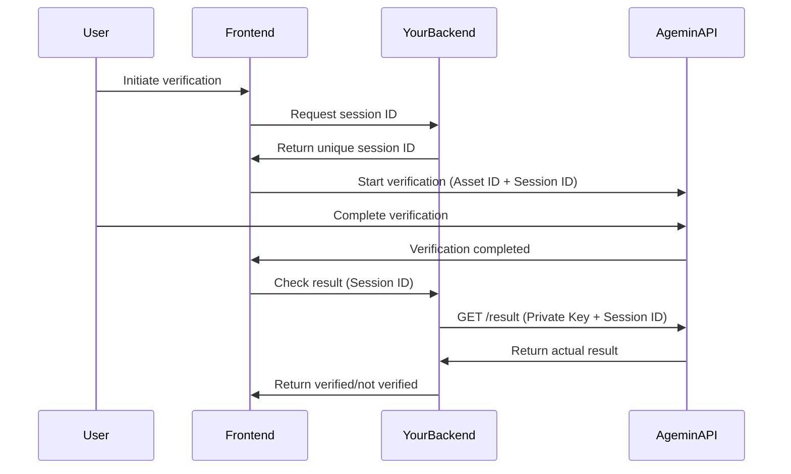

# Agemin SDK

[](https://www.npmjs.com/package/@bynn-intelligence/agemin-sdk)
[](https://opensource.org/licenses/MIT)

A secure, type-safe JavaScript/TypeScript SDK for integrating Agemin age verification into your web applications.

> **🔒 Security-First Design**: This SDK uses a secure architecture where verification results are only accessible server-side using your private API key, preventing abuse and ensuring billing security.

> **📝 Prerequisites**: 
> 1. Create a free account on [agemin.com](https://agemin.com)
> 2. Get your **Asset ID** from [agemin.com/app/websites](https://agemin.com/app/websites) (format: `asset_5b08b274353b92f4`)
> 3. Get your **Private Key** from [agemin.com/app/api-keys](https://agemin.com/app/api-keys)
> 4. Keep your Private Key secure on your backend server

## Features

- 🚀 **Easy Integration** - Simple API with automatic initialization support
- 📱 **Cross-Platform** - Works on desktop and mobile browsers
- 🎨 **Customizable** - Theme support (light/dark/auto) and localization
- 🔒 **Secure** - Cross-origin communication with trusted domain validation
- 📦 **Lightweight** - Zero runtime dependencies
- 💪 **TypeScript** - Full TypeScript support with comprehensive type definitions
- 🎯 **Flexible** - Multiple verification modes (modal, popup, redirect)
- ⚛️ **React Compatible** - Singleton pattern prevents duplicate modals in StrictMode (v5.0+)

## Getting Started

1. **Sign up for a free account** at [agemin.com](https://agemin.com)
2. **Get your Asset ID** at [agemin.com/app/websites](https://agemin.com/app/websites)
   - Each website/app has a unique Asset ID (e.g., `asset_5b08b274353b92f4`)
   - Use this Asset ID in your frontend SDK
3. **Get your Private Key** at [agemin.com/app/api-keys](https://agemin.com/app/api-keys)
   - Keep this secure on your backend only
4. **Install the SDK** using your preferred package manager
5. **Generate reference IDs** server-side for each verification
6. **Initialize SDK** with Asset ID and Reference ID
7. **Verify results** server-side using your Private Key

## Installation

### NPM
```bash
npm install @bynn-intelligence/agemin-sdk
```

### Yarn
```bash
yarn add @bynn-intelligence/agemin-sdk
```

### pnpm
```bash
pnpm add @bynn-intelligence/agemin-sdk
```

### CDN
```html
<!-- Latest version -->
<script src="https://unpkg.com/@bynn-intelligence/agemin-sdk/dist/agemin-sdk.umd.js"></script>

<!-- Specific version -->
<script src="https://unpkg.com/@bynn-intelligence/agemin-sdk@2.0.1/dist/agemin-sdk.umd.js"></script>

<!-- Minified version -->
<script src="https://unpkg.com/@bynn-intelligence/agemin-sdk/dist/agemin-sdk.min.js"></script>
```

## ⚠️ Breaking Change in v5.0.0

**Version 5.0.0 introduces a singleton pattern** to prevent multiple verification modals in React StrictMode and other scenarios. Only one Agemin instance can exist at a time.

### Migration from v4.x to v5.x

```javascript
// OLD (v4.x) - Multiple instances allowed
const agemin1 = new Agemin(config1); // Creates instance 1
const agemin2 = new Agemin(config2); // Creates instance 2 (different instance)

// NEW (v5.x) - Singleton pattern
const agemin1 = new Agemin(config1); // Creates first instance
const agemin2 = new Agemin(config2); // Returns the SAME instance as agemin1

// To create a new instance with different config, use reset()
Agemin.reset(); // Clear the singleton
const agemin3 = new Agemin(config3); // Now creates a new instance
```

## Quick Start

### Frontend Implementation

```javascript
import Agemin from '@bynn-intelligence/agemin-sdk';

// 1. Get reference ID from your backend
const response = await fetch('/api/agemin/reference', { method: 'POST' });
const { referenceId } = await response.json();

// 2. Initialize SDK with Asset ID and Reference ID
// Note: In v5.x, only the first call creates an instance
const agemin = new Agemin({
  assetId: 'ast_5b08b274353b92f4',    // Your Asset ID from agemin.com/app/websites
  referenceId: referenceId,           // Unique reference ID from your backend (max 50 bytes)
  metadata: { userId: 123 },          // Optional metadata (max 256 bytes when stringified)
  debug: true
});

// Alternative: Use getInstance() to get existing instance
const agemin = Agemin.getInstance(); // Get existing instance
// or create if doesn't exist:
const agemin = Agemin.getInstance(config);

// 3. Optional: Register event listeners for real-time updates
agemin.onAppReady(() => {
  console.log('Verification app loaded successfully');
});

agemin.onProgress((data) => {
  console.log(`Progress: ${data.percentage}% - ${data.stage}`);
  // Update your UI with progress information
});

agemin.onStateChange((data) => {
  console.log(`State changed from ${data.from} to ${data.to}`);
});

agemin.onUserAction((data) => {
  console.log(`User action: ${data.type} on ${data.target}`);
  // Track user interactions for analytics
});

// 4. Start verification
agemin.verify({
  onSuccess: (result) => {
    // Verification process completed (doesn't mean user passed)
    // If using strong API security, check results server-side
    console.log('Verification completed:', result.referenceId);
  },
  
  onAgePass: (result) => {
    // User passed age verification (JWT present and is_of_age = true)
    console.log('Age verification passed');
    window.location.href = '/protected-content';
  },
  
  onAgeFail: (result) => {
    // User failed age verification (JWT present but is_of_age = false)
    console.log('Age verification failed');
    window.location.href = '/age-restricted';
  },
  
  onError: (error) => {
    // Technical error - show fallback
    console.error('Technical error:', error);
    showFallbackAgeModal();
  },
  
  onCancel: () => {
    console.log('User cancelled verification');
  }
});
```

### Age Gating Every Page

To ensure all your pages are properly age-gated, use the `validateSession` method at the top of each protected page:

```javascript
// On every age-restricted page
const agemin = new Agemin({
  assetId: 'ast_A6ctvqk5egQtCoZhr5LrWkRm',
  referenceId: 'unique-reference-id' // Use visitor ID, session ID, or UUID
});

// Check for existing valid session or launch verification
const result = await agemin.validateSession({
  onSuccess: (data) => {
    console.log('Verification completed');
    // For strong API security, verify server-side
  },
  
  onAgePass: (data) => {
    console.log('User is age verified');
    // Allow access to content
  },
  
  onAgeFail: (data) => {
    console.log('User did not meet age requirement');
    // Redirect to age-restricted page
    window.location.href = '/age-restricted';
  },
  
  onError: (err) => {
    console.error('Verification error:', err);
    // Show fallback age gate
    showFallbackAgeModal();
  }
});

// If result is true, user already has valid session
if (result === true) {
  console.log('User already age verified from previous session');
  // Content is accessible
}
```

The `validateSession` method will:
- Return `true` immediately if a valid age verification cookie exists
- Automatically launch verification if:
  - No verification cookie exists
  - The JWT is expired or invalid
  - The user previously failed age verification

### React Integration (v5.0+ Singleton Pattern)

The SDK v5.0+ uses a singleton pattern to prevent duplicate modals in React StrictMode:

```javascript
import { useEffect, useRef } from 'react';
import Agemin from '@bynn-intelligence/agemin-sdk';

function AgeGate({ children }) {
  const initialized = useRef(false);
  
  useEffect(() => {
    // React StrictMode will call this twice, but SDK handles it
    if (initialized.current) return;
    initialized.current = true;
    
    // Create Agemin instance (singleton - only first call creates instance)
    const agemin = new Agemin({
      assetId: 'ast_A6ctvqk5egQtCoZhr5LrWkRm',
      referenceId: generateUniqueId(),
      debug: true
    });
    
    // Validate session
    agemin.validateSession({
      onAgePass: () => {
        console.log('User is verified');
      },
      onAgeFail: () => {
        window.location.href = '/age-restricted';
      }
    });
    
    // Cleanup (optional - for testing)
    return () => {
      // Only reset if you need to create a new instance
      // Agemin.reset();
    };
  }, []);
  
  return children;
}
```

**Key Points for React:**
- The SDK automatically handles multiple `new Agemin()` calls by returning the same instance
- Only one verification modal will ever be shown, even in StrictMode
- Use `Agemin.reset()` only when you need to create a completely new instance
- The singleton pattern prevents race conditions and duplicate modals

### Backend Implementation (Node.js Example)

```javascript
// Generate reference endpoint
app.post('/api/agemin/reference', (req, res) => {
  // Generate unique reference ID
  const referenceId = crypto.randomUUID();
  
  // Store reference in database with user context
  await db.references.create({
    id: referenceId,
    userId: req.user?.id,
    createdAt: new Date()
  });
  
  res.json({ referenceId });
});

// Verify result endpoint
app.post('/api/agemin/verify', async (req, res) => {
  const { referenceId } = req.body;
  
  // Fetch verification result from Agemin API using Private Key
  const result = await fetch(`https://api.agemin.com/v1/agemin/result?referenceId=${referenceId}`, {
    headers: {
      'Authorization': `Bearer ${process.env.AGEMIN_PRIVATE_KEY}` // Private key from agemin.com/app/api-keys
    }
  });
  
  const verification = await result.json();
  
  // Check if user meets age requirement
  const verified = verification.status === 'verified';
  
  // Update reference in database
  await db.references.update(referenceId, {
    verified,
    completedAt: new Date()
  });
  
  res.json({ 
    verified,
    age: verification.age // Only if needed
  });
});
```

### Auto-Initialization

You can configure the SDK directly in HTML using data attributes:

```html
<script src="https://unpkg.com/@bynn-intelligence/agemin-sdk/dist/agemin-sdk.min.js"
  data-agemin-asset-id="ast_5b08b274353b92f4"
  data-agemin-reference-id="unique-reference-id"
  data-agemin-theme="auto"
  data-agemin-locale="en"
  data-agemin-debug="true">
</script>

<!-- Any button with data-agemin-trigger will automatically start verification -->
<button data-agemin-trigger>Verify My Age</button>
```

**Note**: The reference ID must be generated server-side and injected into the HTML for security.

## Configuration Options

### SDK Initialization

```typescript
const agemin = new Agemin({
  // Required
  assetId: string;           // Your Asset ID from agemin.com/app/websites (e.g., 'ast_5b08b274353b92f4')
  referenceId: string;       // Unique reference ID (max 50 bytes, generate server-side)
  
  // Optional
  metadata?: Record<string, any>;  // Custom metadata (max 256 bytes when stringified)
  baseUrl?: string;           // Custom verification URL (default: 'https://verify.agemin.com')
  theme?: 'light' | 'dark' | 'auto';  // UI theme (default: 'auto')
  locale?: string;            // Language locale (default: 'en')
  errorUrl?: string;          // URL to redirect on error
  successUrl?: string;        // URL to redirect on success
  cancelUrl?: string;         // URL to redirect on cancellation
  debug?: boolean;            // Enable debug logging (default: false)
});
```

**Size Limits**:
- `referenceId`: Maximum 50 bytes
- `metadata`: Maximum 256 bytes when JSON stringified

These limits ensure efficient data transmission and prevent abuse.

### Verification Options

```typescript
agemin.verify({
  // Display mode
  mode?: 'modal' | 'redirect';  // How to show verification (default: modal)
  
  // Callbacks
  onSuccess?: (result: VerificationResult) => void;  // Verification completed (process finished)
  onAgePass?: (result: VerificationResult) => void;  // User passed age check (JWT present, is_of_age = true)
  onAgeFail?: (result: VerificationResult) => void;  // User failed age check (JWT present, is_of_age = false)
  onError?: (error: VerificationError) => void;      // Technical error (API, network, etc.)
  onCancel?: () => void;                            // User cancelled verification
  onClose?: () => void;                             // Modal closed
  
  // Customization
  theme?: 'light' | 'dark' | 'auto';  // Override default theme
  locale?: string;                     // Override default locale (use 'auto' for browser detection)
  metadata?: Record<string, any>;      // Custom metadata to attach
});
```

### VerificationResult Object

```typescript
interface VerificationResult {
  referenceId: string;  // Reference ID to verify on backend
  completed: boolean;   // Verification process completed
  timestamp: number;    // Completion timestamp
}
```

**Important**: The `onSuccess` callback only indicates the verification process completed. It does NOT mean the user passed the age check. Use `onAgePass` and `onAgeFail` for age-specific results, or verify server-side using your Private Key for strong API security.

## Event Listeners

The SDK provides event listeners for real-time updates during the verification process:

### `onAppReady(callback)`
Called when the verification app has loaded and is ready.

```javascript
agemin.onAppReady(() => {
  console.log('App is ready');
  // Hide loading spinner, enable buttons, etc.
});
```

### `onProgress(callback)`
Receive real-time progress updates during face scanning.

```javascript
agemin.onProgress((data) => {
  console.log(`Progress: ${data.percentage}%`);
  console.log(`Stage: ${data.stage}`);     // e.g., "Hold still", "Move closer"
  console.log(`Message: ${data.message}`); // e.g., "Capture 3/5"
  
  // Update your progress bar
  updateProgressBar(data.percentage);
});
```

### `onStateChange(callback)`
Track state transitions in the verification flow.

```javascript
agemin.onStateChange((data) => {
  console.log(`From: ${data.from}`);
  console.log(`To: ${data.to}`);
  console.log(`Data: ${data.data}`);
  
  // Handle state-specific logic
  if (data.to === 'completed') {
    showSuccessMessage();
  }
});
```

### `onUserAction(callback)`
Monitor user interactions for analytics or UX improvements.

```javascript
agemin.onUserAction((data) => {
  console.log(`Action: ${data.type}`);    // e.g., "cancel", "click"
  console.log(`Target: ${data.target}`);  // e.g., "consent_page", "face_scan_page"
  
  // Track with analytics
  analytics.track('agemin_user_action', data);
});
```

## API Reference

### Methods

#### `verify(options?: VerifyOptions): string`
Starts the verification process. Returns the reference ID.

#### `validateSession(options?: VerifyOptions): Promise<boolean | string>`
Validates if a user has a valid age verification session stored in cookies. 

- Returns `true` if a valid session exists and the user is of age
- Automatically launches verification and returns the reference ID if:
  - No verification cookie exists
  - The JWT token is expired
  - The JWT signature is invalid
  - The user is not of age (`is_of_age: false`)

This method is useful for automatically checking and maintaining age verification across page loads:

```javascript
// Simple usage - automatically handles everything
const result = await agemin.validateSession();
if (result === true) {
  // User already age verified, allow access
  console.log('User has valid age verification');
} else {
  // Verification was launched, result is the referenceId
  console.log('Verification launched with ID:', result);
}

// With callbacks for the verification flow
const result = await agemin.validateSession({
  onSuccess: (data) => {
    console.log('Age verification successful');
    // User is now verified
  },
  onError: (err) => {
    console.error('Verification error:', err);
    // Show fallback age gate
  }
});
```

**Note:** This method requires cookies to be enabled. The verification is stored as a JWT in the `agemin_verification` cookie, with the duration controlled by your website's security settings in the Agemin dashboard.

#### `close(): void`
Programmatically closes the verification modal/popup.

#### `isOpen(): boolean`
Checks if a verification session is currently active.

#### `getReferenceId(): string`
Returns the reference ID for the current verification.

### Static Methods

#### `Agemin.version: string`
Returns the SDK version.

#### `Agemin.isSupported(): boolean`
Checks if the current browser is supported.

## TypeScript Support

The SDK includes comprehensive TypeScript definitions:

```typescript
import Agemin, { 
  AgeminConfig, 
  VerifyOptions, 
  VerificationResult,
  VerificationError 
} from '@bynn-intelligence/agemin-sdk';

// Full type safety and IntelliSense support
const config: AgeminConfig = {
  assetId: 'asset_5b08b274353b92f4',
  theme: 'dark'
};

const agemin = new Agemin(config);
```

## Verification Modes

### Modal (Default)
Opens verification in an iframe overlay within the current page. Works seamlessly on both desktop and mobile devices.

```javascript
agemin.verify({ mode: 'modal' });
```

### Redirect
Redirects the entire page to the verification URL. Useful for single-page flows or when iframe is not suitable.

```javascript
agemin.verify({ mode: 'redirect' });
```

## Event Handling

The SDK provides comprehensive event callbacks for different scenarios:

```javascript
agemin.verify({
  onSuccess: (result) => {
    // Verification process completed successfully
    console.log('Reference ID:', result.referenceId);
    console.log('Completed:', result.completed); // true
    // Note: This doesn't indicate if user passed age check
    // For strong API security, verify results server-side
  },
  
  onAgePass: (result) => {
    // User passed age verification (JWT present and is_of_age = true)
    console.log('User meets age requirement');
    // Allow access to age-restricted content
  },
  
  onAgeFail: (result) => {
    // User failed age verification (JWT present but is_of_age = false)
    console.log('User does not meet age requirement');
    // Redirect to age-appropriate content or show restriction message
  },
  
  onError: (error) => {
    // Technical error occurred (API, network, model error, etc.)
    console.error('Error code:', error.code);
    console.error('Error message:', error.message);
    
    // IMPORTANT: Show fallback age confirmation to avoid losing visitors
    // Example: Display a simple "Are you 18+" modal as backup
    showBackupAgeGate();
  },
  
  onCancel: () => {
    // User explicitly cancelled the verification process
    console.log('User cancelled');
  },
  
  onClose: () => {
    // Modal/popup was closed (fired after other callbacks)
    console.log('Verification window closed');
  }
});
```

### Important: Handling Technical Errors

When `onError` is triggered (technical issues), we strongly recommend showing a fallback age confirmation modal to ensure you don't lose potential visitors due to temporary technical issues:

```javascript
function showBackupAgeGate() {
  // Simple fallback when Agemin verification has technical issues
  const confirmed = confirm('Please confirm you are 18 or older to continue');
  if (confirmed) {
    // Allow access with degraded verification
    allowAccess();
  } else {
    // Redirect to age-appropriate content
    window.location.href = '/underage';
  }
}
```

## Examples

### React Integration

```jsx
import React, { useEffect, useState } from 'react';
import Agemin from '@bynn-intelligence/agemin-sdk';

function AgeVerification() {
  const [agemin, setAgemin] = useState(null);
  const [isVerified, setIsVerified] = useState(false);
  
  useEffect(() => {
    const sdk = new Agemin({
      assetId: process.env.REACT_APP_AGEMIN_ASSET_ID
    });
    setAgemin(sdk);
  }, []);
  
  const handleVerify = () => {
    agemin?.verify({
      onSuccess: (result) => {
        console.log('Verification completed');
        // For strong API security, verify results server-side
      },
      onAgePass: (result) => {
        setIsVerified(true);
        // User passed age verification
      },
      onAgeFail: (result) => {
        // User is underage
        alert('You must be 18 or older to access this content');
        window.location.href = '/age-restricted';
      },
      onError: (error) => {
        // Technical error - show fallback
        if (confirm('Please confirm you are 18 or older')) {
          setIsVerified(true);
        }
      }
    });
  };
  
  return (
    <div>
      {!isVerified ? (
        <button onClick={handleVerify}>Verify Age</button>
      ) : (
        <p>✅ Age verified!</p>
      )}
    </div>
  );
}
```

### Vue.js Integration

```vue
<template>
  <div>
    <button @click="verifyAge" v-if="!isVerified">
      Verify Age
    </button>
    <p v-else>✅ Age verified!</p>
  </div>
</template>

<script>
import Agemin from '@bynn-intelligence/agemin-sdk';

export default {
  data() {
    return {
      agemin: null,
      isVerified: false
    };
  },
  
  mounted() {
    this.agemin = new Agemin({
      assetId: process.env.VUE_APP_AGEMIN_ASSET_ID
    });
  },
  
  methods: {
    verifyAge() {
      this.agemin.verify({
        onSuccess: (result) => {
          console.log('Verification completed');
        },
        onAgePass: (result) => {
          this.isVerified = true;
          // User passed age verification
        },
        onAgeFail: (result) => {
          alert('You must be 18 or older to access this content');
          window.location.href = '/age-restricted';
        },
        onError: (error) => {
          alert(`Verification failed: ${error.message}`);
        }
      });
    }
  }
};
</script>
```

### Custom Metadata

You can attach custom metadata to verification sessions:

```javascript
agemin.verify({
  metadata: {
    source: 'checkout-page',
    productId: 'ABC123',
    userId: 'user-456',
    timestamp: Date.now()
  },
  onSuccess: (result) => {
    // Metadata is included in the verification result
    console.log('Verification completed with metadata');
  }
});
```

## Browser Support

The SDK supports all modern browsers:

- Chrome 90+
- Firefox 88+
- Safari 14+
- Edge 90+
- Mobile Safari (iOS 14+)
- Chrome Mobile (Android)

## Development

### Building from Source

```bash
# Clone the repository
git clone https://github.com/Bynn-Intelligence/agemin-sdk.git
cd agemin-sdk

# Install dependencies
npm install

# Build the SDK
npm run build

# Watch mode for development
npm run dev
```

### Running Examples

```bash
# Build the SDK first
npm run build

# Open an example in your browser
open examples/basic.html
```

## Security Architecture

### Why Server-Side Verification?

This SDK uses a secure two-step verification process:

1. **Frontend** handles the UI/UX of age verification
2. **Backend** fetches and validates the actual results

This architecture prevents:
- **Billing fraud**: Others can't use your Asset ID without your knowledge
- **Result tampering**: Verification results can't be faked client-side
- **API key exposure**: Your Private Key never leaves your server

### Security Flow



### API Keys

- **Asset ID**: Get from [agemin.com/app/websites](https://agemin.com/app/websites)
  - Each website/app has a unique Asset ID (format: `asset_5b08b274353b92f4`)
  - Safe to use in frontend code
- **Private Key**: Get from [agemin.com/app/api-keys](https://agemin.com/app/api-keys)
  - NEVER expose in frontend code, keep on backend only

### Best Practices

1. **Generate Session IDs server-side**: Use cryptographically secure random generators
2. **Validate sessions**: Track sessions in your database to prevent replay attacks
3. **Set session expiry**: Expire unused sessions after a reasonable time
4. **Use HTTPS**: Always use HTTPS in production
5. **Secure your Private Key**: Store in environment variables, never commit to code

## Error Handling

### Technical Errors

Technical errors trigger `onError` and should be handled with a fallback:

```javascript
agemin.verify({
  onError: (error) => {
    // Log the technical error for debugging
    console.error('Technical error:', error.code, error.message);
    
    // Show fallback age gate to avoid losing visitors
    switch (error.code) {
      case 'POPUP_BLOCKED':
        alert('Please allow popups for age verification');
        showSimpleAgeGate();
        break;
      
      case 'NETWORK_ERROR':
      case 'API_ERROR':
      case 'MODEL_ERROR':
        // Don't lose the visitor - show backup age confirmation
        showSimpleAgeGate();
        break;
      
      default:
        showSimpleAgeGate();
    }
  }
});

function showSimpleAgeGate() {
  // Fallback for when Agemin verification has technical issues
  const isAdult = confirm('Are you 18 years or older?');
  if (isAdult) {
    // Grant degraded access
    grantAccess(/* limited = */ true);
  } else {
    redirectToAgeAppropriate();
  }
}
```

## Guide for AI Assistants (LLMs)

This section helps AI assistants understand how to guide developers in integrating the Agemin SDK.

### What This SDK Does

The Agemin SDK provides age verification through facial scanning. It offers two main methods for integration, each suited for different use cases.

### Two Ways to Verify Age

#### Method 1: Manual Verification (`verify`)

```
User clicks button → Modal opens → Face scan → Result callbacks
```

**When to use:** User explicitly triggers verification (e.g., "Verify Age" button)

**Callbacks flow:**
- `onSuccess` - Always fires when verification completes
- `onAgePass` - Fires if user meets age requirement  
- `onAgeFail` - Fires if user doesn't meet requirement
- `onError` - Fires on technical problems
- `onCancel` - Fires if user closes modal

#### Method 2: Automatic Verification (`validateSession`)

```
Page loads → Check saved session → If valid: continue | If not: auto-launch verify
```

**When to use:** Protecting multiple pages automatically

**Returns:** 
- `true` if user already verified (has valid session)
- Launches verification modal if no valid session exists

### Simple Decision Guide

```
Single "Verify Age" button?          → Use verify()
Protect every page automatically?    → Use validateSession()  
Want seamless multi-page experience? → Use validateSession()
```

### Understanding the Callbacks

```
Verification Process Flow:
┌─────────────────┐
│ Verification    │
│ Completes       │ → onSuccess (always called)
└────────┬────────┘
         │
    ┌────┴────┐
    │ Result? │
    └────┬────┘
         │
    ┌────┴────────────┐
    │                 │
    ↓                 ↓
onAgePass         onAgeFail
(Age met)         (Age not met)

Technical Error → onError
User Closes    → onCancel
```

### Integration Checklist for AI Assistants

When helping developers integrate this SDK:

- [ ] **Asset ID**: Ensure developer has Asset ID from agemin.com/app/websites
- [ ] **Reference ID**: Each verification needs a unique reference ID
- [ ] **Choose method**: 
  - Single button/trigger → Use `verify()`
  - Automatic page protection → Use `validateSession()`
- [ ] **Prevent infinite loops**: Age-fail redirect pages must NOT be age-gated
- [ ] **Session persistence**: `validateSession()` remembers users across pages
- [ ] **Callback handling**: Implement appropriate callbacks for the use case

### Common Integration Patterns

| Use Case | Recommended Method | Why |
|----------|-------------------|-----|
| E-commerce checkout | `validateSession()` | Seamless multi-step process |
| Content website | `validateSession()` | Protects all restricted pages |
| Single landing page | `verify()` | One-time verification |
| Terms acceptance | `verify()` | Explicit user action |
| Gaming platform | `validateSession()` | Persistent access control |

### Key Concepts to Explain

1. **Session Management**: The SDK handles session storage automatically - developers don't manage cookies or tokens

2. **Verification Flow**: 
   - User's age is verified through face scanning
   - Result is stored securely
   - Future page visits check this stored result

3. **Security Models**:
   - **Strong API Security**: Results only available server-side (onSuccess fires, no age result in frontend)
   - **Standard Security**: Age result available in callbacks (onAgePass/onAgeFail)

### Common Pitfalls to Warn About

1. **Infinite Loop**: Never use `validateSession()` on the age-fail redirect page
2. **Unique IDs**: Each user needs a unique reference ID (use session ID or user ID)
3. **Method Confusion**: Don't use `verify()` for automatic page protection
4. **Callback Misunderstanding**: `onSuccess` ≠ user passed age check

### Guidance Summary

When an LLM helps a developer:
1. First, understand if they need single-trigger or automatic protection
2. For automatic protection across pages → `validateSession()`
3. For button-triggered verification → `verify()`
4. Always warn about the infinite loop risk with age-fail pages
5. Emphasize that the SDK handles all session management internally

## License

MIT License - see [LICENSE](LICENSE) file for details.

## Support

- **Documentation**: [https://docs.agemin.com](https://docs.agemin.com)
- **Issues**: [GitHub Issues](https://github.com/Bynn-Intelligence/agemin-sdk/issues)
- **npm Package**: [https://www.npmjs.com/package/@bynn-intelligence/agemin-sdk](https://www.npmjs.com/package/@bynn-intelligence/agemin-sdk)
- **Email**: support@agemin.com

## Contributing

We welcome contributions! Please see our [Contributing Guide](CONTRIBUTING.md) for details.

## Changelog

See [CHANGELOG.md](CHANGELOG.md) for a list of changes in each version.