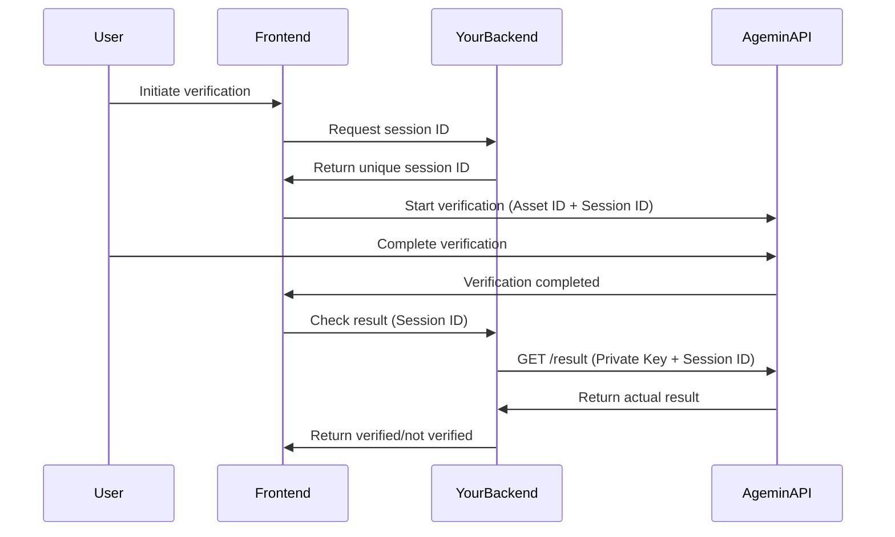

# Agemin SDK

[](https://www.npmjs.com/package/@bynn-intelligence/agemin-sdk)
[](https://opensource.org/licenses/MIT)

A secure, type-safe JavaScript/TypeScript SDK for integrating Agemin age verification into your web applications.

> **🔒 Security-First Design**: This SDK uses a secure architecture where verification results are only accessible server-side using your private API key, preventing abuse and ensuring billing security.

> **📝 Prerequisites**: 
> 1. Create a free account on [agemin.com](https://agemin.com)
> 2. Get your **Asset ID** from [agemin.com/app/websites](https://agemin.com/app/websites) (format: `asset_5b08b274353b92f4`)
> 3. Get your **Private Key** from [agemin.com/app/api-keys](https://agemin.com/app/api-keys)
> 4. Keep your Private Key secure on your backend server

## Features

- 🚀 **Easy Integration** - Simple API with automatic initialization support
- 📱 **Cross-Platform** - Works on desktop and mobile browsers
- 🎨 **Customizable** - Theme support (light/dark/auto) and localization
- 🔒 **Secure** - Cross-origin communication with trusted domain validation
- 📦 **Lightweight** - Zero runtime dependencies
- 💪 **TypeScript** - Full TypeScript support with comprehensive type definitions
- 🎯 **Flexible** - Multiple verification modes (modal, popup, redirect)

## Getting Started

1. **Sign up for a free account** at [agemin.com](https://agemin.com)
2. **Get your Asset ID** at [agemin.com/app/websites](https://agemin.com/app/websites)
   - Each website/app has a unique Asset ID (e.g., `asset_5b08b274353b92f4`)
   - Use this Asset ID in your frontend SDK
3. **Get your Private Key** at [agemin.com/app/api-keys](https://agemin.com/app/api-keys)
   - Keep this secure on your backend only
4. **Install the SDK** using your preferred package manager
5. **Generate session IDs** server-side for each verification
6. **Initialize SDK** with Asset ID and Session ID
7. **Verify results** server-side using your Private Key

## Installation

### NPM
```bash
npm install @bynn-intelligence/agemin-sdk
```

### Yarn
```bash
yarn add @bynn-intelligence/agemin-sdk
```

### pnpm
```bash
pnpm add @bynn-intelligence/agemin-sdk
```

### CDN
```html
<!-- Latest version -->
<script src="https://unpkg.com/@bynn-intelligence/agemin-sdk/dist/agemin-sdk.umd.js"></script>

<!-- Specific version -->
<script src="https://unpkg.com/@bynn-intelligence/agemin-sdk@2.0.1/dist/agemin-sdk.umd.js"></script>

<!-- Minified version -->
<script src="https://unpkg.com/@bynn-intelligence/agemin-sdk/dist/agemin-sdk.min.js"></script>
```

## Quick Start

### Frontend Implementation

```javascript
import Agemin from '@bynn-intelligence/agemin-sdk';

// 1. Get session ID from your backend
const response = await fetch('/api/agemin/session', { method: 'POST' });
const { sessionId } = await response.json();

// 2. Initialize SDK with Asset ID and Session ID
const agemin = new Agemin({
  assetId: 'asset_5b08b274353b92f4',  // Your Asset ID from agemin.com/app/websites
  sessionId: sessionId,       // Unique session ID from your backend (max 50 bytes)
  metadata: { userId: 123 },  // Optional metadata (max 50 bytes when stringified)
  debug: true
});

// 3. Start verification
agemin.verify({
  onSuccess: async (result) => {
    // Verification completed - check actual result server-side
    console.log('Verification completed:', result.sessionId);
    
    // 4. Verify the actual result on your backend
    const verifyResponse = await fetch('/api/agemin/verify', {
      method: 'POST',
      headers: { 'Content-Type': 'application/json' },
      body: JSON.stringify({ sessionId: result.sessionId })
    });
    
    const { verified, age } = await verifyResponse.json();
    if (verified) {
      // User meets age requirement
      window.location.href = '/protected-content';
    } else {
      // User doesn't meet age requirement
      window.location.href = '/age-restricted';
    }
  },
  onError: (error) => {
    // Technical error - show fallback
    console.error('Technical error:', error);
    showFallbackAgeModal();
  },
  onCancel: () => {
    console.log('User cancelled verification');
  }
});
```

### Backend Implementation (Node.js Example)

```javascript
// Generate session endpoint
app.post('/api/agemin/session', (req, res) => {
  // Generate unique session ID
  const sessionId = crypto.randomUUID();
  
  // Store session in database with user context
  await db.sessions.create({
    id: sessionId,
    userId: req.user?.id,
    createdAt: new Date()
  });
  
  res.json({ sessionId });
});

// Verify result endpoint
app.post('/api/agemin/verify', async (req, res) => {
  const { sessionId } = req.body;
  
  // Fetch verification result from Agemin API using Private Key
  const result = await fetch(`https://api.agemin.com/v1/agemin/result?sessionId=${sessionId}`, {
    headers: {
      'Authorization': `Bearer ${process.env.AGEMIN_PRIVATE_KEY}` // Private key from agemin.com/app/api-keys
    }
  });
  
  const verification = await result.json();
  
  // Check if user meets age requirement
  const verified = verification.status === 'verified';
  
  // Update session in database
  await db.sessions.update(sessionId, {
    verified,
    completedAt: new Date()
  });
  
  res.json({ 
    verified,
    age: verification.age // Only if needed
  });
});
```

### Auto-Initialization

You can configure the SDK directly in HTML using data attributes:

```html
<script src="https://unpkg.com/@bynn-intelligence/agemin-sdk/dist/agemin-sdk.min.js"
  data-agemin-asset-id="asset_5b08b274353b92f4"
  data-agemin-session-id="unique-session-id"
  data-agemin-theme="auto"
  data-agemin-locale="en"
  data-agemin-debug="true">
</script>

<!-- Any button with data-agemin-trigger will automatically start verification -->
<button data-agemin-trigger>Verify My Age</button>
```

**Note**: The session ID must be generated server-side and injected into the HTML for security.

## Configuration Options

### SDK Initialization

```typescript
const agemin = new Agemin({
  // Required
  assetId: string;           // Your Asset ID from agemin.com/app/websites (e.g., 'asset_5b08b274353b92f4')
  sessionId: string;         // Unique session ID (max 50 bytes, generate server-side)
  
  // Optional
  metadata?: Record<string, any>;  // Custom metadata (max 50 bytes when stringified)
  baseUrl?: string;           // Custom verification URL (default: 'https://verify.agemin.com')
  theme?: 'light' | 'dark' | 'auto';  // UI theme (default: 'auto')
  locale?: string;            // Language locale (default: 'en')
  errorUrl?: string;          // URL to redirect on error
  successUrl?: string;        // URL to redirect on success
  cancelUrl?: string;         // URL to redirect on cancellation
  debug?: boolean;            // Enable debug logging (default: false)
});
```

**Size Limits**:
- `sessionId`: Maximum 50 bytes
- `metadata`: Maximum 50 bytes when JSON stringified

These limits ensure efficient data transmission and prevent abuse.

### Verification Options

```typescript
agemin.verify({
  // Display mode
  mode?: 'modal' | 'redirect';  // How to show verification (default: modal)
  
  // Callbacks
  onSuccess?: (result: VerificationResult) => void;  // Verification completed (check result server-side)
  onError?: (error: VerificationError) => void;      // Technical error (API, network, etc.)
  onCancel?: () => void;                            // User cancelled verification
  onClose?: () => void;                             // Modal closed
  
  // Customization
  theme?: 'light' | 'dark' | 'auto';  // Override default theme
  locale?: string;                     // Override default locale
  metadata?: Record<string, any>;      // Custom metadata to attach
});
```

### VerificationResult Object

```typescript
interface VerificationResult {
  sessionId: string;   // Session ID to verify on backend
  completed: boolean;  // Verification process completed
  timestamp: number;   // Completion timestamp
}
```

**Important**: The `onSuccess` callback only indicates the verification process completed. You MUST verify the actual age verification result server-side using your Private Key.

## API Reference

### Methods

#### `verify(options?: VerifyOptions): string`
Starts the verification process. Returns a unique session ID.

#### `close(): void`
Programmatically closes the verification modal/popup.

#### `isOpen(): boolean`
Checks if a verification session is currently active.

#### `getSession(): Session | null`
Returns the current verification session object.

### Static Methods

#### `Agemin.version: string`
Returns the SDK version.

#### `Agemin.isSupported(): boolean`
Checks if the current browser is supported.

## TypeScript Support

The SDK includes comprehensive TypeScript definitions:

```typescript
import Agemin, { 
  AgeminConfig, 
  VerifyOptions, 
  VerificationResult,
  VerificationError 
} from '@bynn-intelligence/agemin-sdk';

// Full type safety and IntelliSense support
const config: AgeminConfig = {
  assetId: 'asset_5b08b274353b92f4',
  theme: 'dark'
};

const agemin = new Agemin(config);
```

## Verification Modes

### Modal (Default)
Opens verification in an iframe overlay within the current page. Works seamlessly on both desktop and mobile devices.

```javascript
agemin.verify({ mode: 'modal' });
```

### Redirect
Redirects the entire page to the verification URL. Useful for single-page flows or when iframe is not suitable.

```javascript
agemin.verify({ mode: 'redirect' });
```

## Event Handling

The SDK provides comprehensive event callbacks for different scenarios:

```javascript
agemin.verify({
  onSuccess: (result) => {
    // Visitor successfully verified AND meets age requirement
    console.log('Session ID:', result.sessionId);
    console.log('Verification token:', result.token);
    console.log('Status:', result.status); // 'verified'
    // Allow access to age-restricted content
  },
  
  onFail: (result) => {
    // Visitor completed verification but doesn't meet age requirement
    console.log('Status:', result.status); // 'underage'
    // Redirect to age-appropriate content or show restriction message
  },
  
  onError: (error) => {
    // Technical error occurred (API, network, model error, etc.)
    console.error('Error code:', error.code);
    console.error('Error message:', error.message);
    
    // IMPORTANT: Show fallback age confirmation to avoid losing visitors
    // Example: Display a simple "Are you 18+" modal as backup
    showBackupAgeGate();
  },
  
  onCancel: () => {
    // User explicitly cancelled the verification process
    console.log('User cancelled');
  },
  
  onClose: () => {
    // Modal/popup was closed (fired after other callbacks)
    console.log('Verification window closed');
  }
});
```

### Important: Handling Technical Errors

When `onError` is triggered (technical issues), we strongly recommend showing a fallback age confirmation modal to ensure you don't lose potential visitors due to temporary technical issues:

```javascript
function showBackupAgeGate() {
  // Simple fallback when Agemin verification has technical issues
  const confirmed = confirm('Please confirm you are 18 or older to continue');
  if (confirmed) {
    // Allow access with degraded verification
    allowAccess();
  } else {
    // Redirect to age-appropriate content
    window.location.href = '/underage';
  }
}
```

## Examples

### React Integration

```jsx
import React, { useEffect, useState } from 'react';
import Agemin from '@bynn-intelligence/agemin-sdk';

function AgeVerification() {
  const [agemin, setAgemin] = useState(null);
  const [isVerified, setIsVerified] = useState(false);
  
  useEffect(() => {
    const sdk = new Agemin({
      assetId: process.env.REACT_APP_AGEMIN_ASSET_ID
    });
    setAgemin(sdk);
  }, []);
  
  const handleVerify = () => {
    agemin?.verify({
      onSuccess: (result) => {
        setIsVerified(true);
        // Store verification token
        localStorage.setItem('agemin_token', result.token);
      },
      onFail: (result) => {
        // Visitor is underage
        alert('You must be 18 or older to access this content');
        window.location.href = '/age-restricted';
      },
      onError: (error) => {
        // Technical error - show fallback
        if (confirm('Please confirm you are 18 or older')) {
          setIsVerified(true);
        }
      }
    });
  };
  
  return (
    <div>
      {!isVerified ? (
        <button onClick={handleVerify}>Verify Age</button>
      ) : (
        <p>✅ Age verified!</p>
      )}
    </div>
  );
}
```

### Vue.js Integration

```vue
<template>
  <div>
    <button @click="verifyAge" v-if="!isVerified">
      Verify Age
    </button>
    <p v-else>✅ Age verified!</p>
  </div>
</template>

<script>
import Agemin from '@bynn-intelligence/agemin-sdk';

export default {
  data() {
    return {
      agemin: null,
      isVerified: false
    };
  },
  
  mounted() {
    this.agemin = new Agemin({
      assetId: process.env.VUE_APP_AGEMIN_ASSET_ID
    });
  },
  
  methods: {
    verifyAge() {
      this.agemin.verify({
        onSuccess: (result) => {
          this.isVerified = true;
          localStorage.setItem('agemin_token', result.token);
        },
        onError: (error) => {
          alert(`Verification failed: ${error.message}`);
        }
      });
    }
  }
};
</script>
```

### Custom Metadata

You can attach custom metadata to verification sessions:

```javascript
agemin.verify({
  metadata: {
    source: 'checkout-page',
    productId: 'ABC123',
    userId: 'user-456',
    timestamp: Date.now()
  },
  onSuccess: (result) => {
    // Metadata is included in the verification result
    console.log('Verification completed with metadata');
  }
});
```

## Browser Support

The SDK supports all modern browsers:

- Chrome 90+
- Firefox 88+
- Safari 14+
- Edge 90+
- Mobile Safari (iOS 14+)
- Chrome Mobile (Android)

## Development

### Building from Source

```bash
# Clone the repository
git clone https://github.com/Bynn-Intelligence/agemin-sdk.git
cd agemin-sdk

# Install dependencies
npm install

# Build the SDK
npm run build

# Watch mode for development
npm run dev
```

### Running Examples

```bash
# Build the SDK first
npm run build

# Open an example in your browser
open examples/basic.html
```

## Security Architecture

### Why Server-Side Verification?

This SDK uses a secure two-step verification process:

1. **Frontend** handles the UI/UX of age verification
2. **Backend** fetches and validates the actual results

This architecture prevents:
- **Billing fraud**: Others can't use your Asset ID without your knowledge
- **Result tampering**: Verification results can't be faked client-side
- **API key exposure**: Your Private Key never leaves your server

### Security Flow



### API Keys

- **Asset ID**: Get from [agemin.com/app/websites](https://agemin.com/app/websites)
  - Each website/app has a unique Asset ID (format: `asset_5b08b274353b92f4`)
  - Safe to use in frontend code
- **Private Key**: Get from [agemin.com/app/api-keys](https://agemin.com/app/api-keys)
  - NEVER expose in frontend code, keep on backend only

### Best Practices

1. **Generate Session IDs server-side**: Use cryptographically secure random generators
2. **Validate sessions**: Track sessions in your database to prevent replay attacks
3. **Set session expiry**: Expire unused sessions after a reasonable time
4. **Use HTTPS**: Always use HTTPS in production
5. **Secure your Private Key**: Store in environment variables, never commit to code

## Error Handling

### Technical Errors

Technical errors trigger `onError` and should be handled with a fallback:

```javascript
agemin.verify({
  onError: (error) => {
    // Log the technical error for debugging
    console.error('Technical error:', error.code, error.message);
    
    // Show fallback age gate to avoid losing visitors
    switch (error.code) {
      case 'POPUP_BLOCKED':
        alert('Please allow popups for age verification');
        showSimpleAgeGate();
        break;
      
      case 'NETWORK_ERROR':
      case 'API_ERROR':
      case 'MODEL_ERROR':
        // Don't lose the visitor - show backup age confirmation
        showSimpleAgeGate();
        break;
      
      default:
        showSimpleAgeGate();
    }
  }
});

function showSimpleAgeGate() {
  // Fallback for when Agemin verification has technical issues
  const isAdult = confirm('Are you 18 years or older?');
  if (isAdult) {
    // Grant degraded access
    grantAccess(/* limited = */ true);
  } else {
    redirectToAgeAppropriate();
  }
}
```

## License

MIT License - see [LICENSE](LICENSE) file for details.

## Support

- **Documentation**: [https://docs.agemin.com](https://docs.agemin.com)
- **Issues**: [GitHub Issues](https://github.com/Bynn-Intelligence/agemin-sdk/issues)
- **npm Package**: [https://www.npmjs.com/package/@bynn-intelligence/agemin-sdk](https://www.npmjs.com/package/@bynn-intelligence/agemin-sdk)
- **Email**: support@agemin.com

## Contributing

We welcome contributions! Please see our [Contributing Guide](CONTRIBUTING.md) for details.

## Changelog

See [CHANGELOG.md](CHANGELOG.md) for a list of changes in each version.